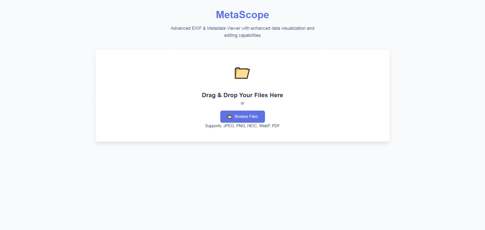

# 🧭 MetaScope - EXIF & Metadata Viewer

MetaScope is a powerful web tool that lets you **view**, **edit**, and **analyze** metadata in your files directly in the browser.  
Perfect for photographers, privacy-conscious users, and digital forensics.




---

## ✨ Key Features

- 🔍 View EXIF, GPS, and other metadata from images  
- 🗺️ Interactive map for geotagged photos  
- 🧹 Remove sensitive metadata before sharing files  
- 🖥️ Clean, user-friendly interface  
- 🔒 Works completely in your browser (no uploads to servers)  

---

## 📖 How to Use

1. Open **MetaScope** in your web browser  
2. Drag and drop any image file (JPEG, PNG, etc.) or click to browse  
3. View all metadata organized in easy-to-read sections  
4. Edit or remove any information as needed  
5. Download the cleaned version of your file  

---

## ⚙️ Technical Details

MetaScope uses:

- [`exif-js`](https://github.com/exif-js/exif-js) for reading image metadata  
- [`Leaflet.js`](https://leafletjs.com/) for interactive maps  
- Modern web technologies: **HTML5**, **CSS3**, **JavaScript**  

---

## 🚀 Getting Started

To run locally:

```bash
git clone https://github.com/hasanulhossaint/MetaScope.git
cd metascope
```
# Open index.html in any modern browser
✅ **No installation or dependencies required**

---

## 🔮 Future Plans

- 📷 Support for RAW camera files  
- 📁 Batch processing of multiple files  
- 🎥 Video metadata analysis  
- 🧩 Browser extension version  

---

## ⚠️ Limitations

- Works best with common image formats (JPEG, PNG)  
- Some advanced features may require future server-side components  
- Very large files may take longer to process  

---

## 📄 License

MetaScope is released under the **MIT License**.  
Feel free to use, modify, and distribute.

---

## 🛠️ Support

For issues or feature requests, please [open an issue](https://github.com/hasanulhossaint/MetaScope/issues) on our GitHub repository.
